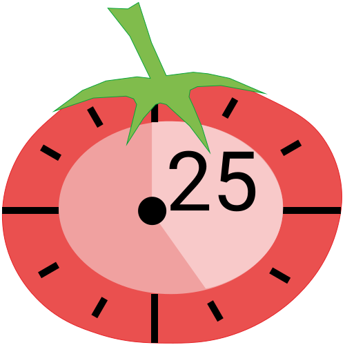
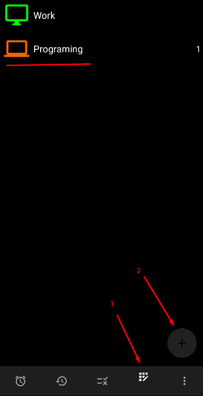
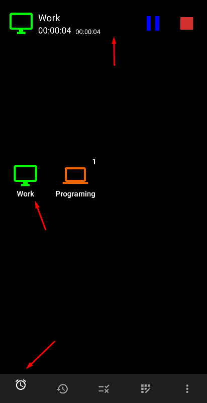
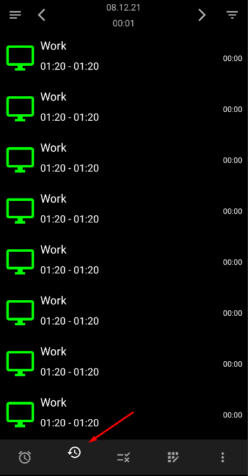
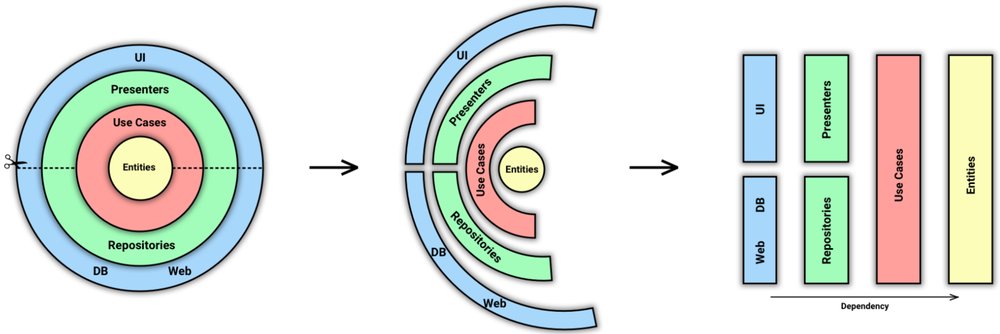

# TimeTracker + Pomodoro

Time tracker with pomodoro technology connection and event notification.

- [Time management](https://en.wikipedia.org/wiki/Time_management)
- [Pomodoro](https://en.wikipedia.org/wiki/Pomodoro_Technique)

## Help

- [Adding Actions] First add all the required actions

- [Start Actions] Track your activity constantly

- [History Actions] View your activity history

## Architecture

- [MVVM]
- [Clean-Architecture](https://blog.cleancoder.com/uncle-bob/2012/08/13/the-clean-architecture.html)
- [Use Case]

## Technologies

- [Kotlin](https://kotlinlang.org/) - %100 Kotlin
- [Gradle Kotlin DSL](https://docs.gradle.org/current/userguide/kotlin_dsl.html)
- [Coroutines](https://github.com/Kotlin/kotlinx.coroutines) for asynchronous operations
- [StateFlow](https://kotlin.github.io/kotlinx.coroutines/kotlinx-coroutines-core/kotlinx.coroutines.flow/-state-flow/)
- [Lifecycle-ktx](https://developer.android.com/kotlin/ktx)
- [ViewModel](https://developer.android.com/topic/libraries/architecture/viewmodel)
- [Navigation](https://developer.android.com/guide/navigation)
- [View Binding](https://developer.android.com/topic/libraries/view-binding)
- [Dagger Hilt](https://developer.android.com/training/dependency-injection/hilt-android) for
  Dependency Injection
- [Room](https://developer.android.com/training/data-storage/room) for managing a local SQLite  database
- [Glide](https://github.com/bumptech/glide) for image loading
